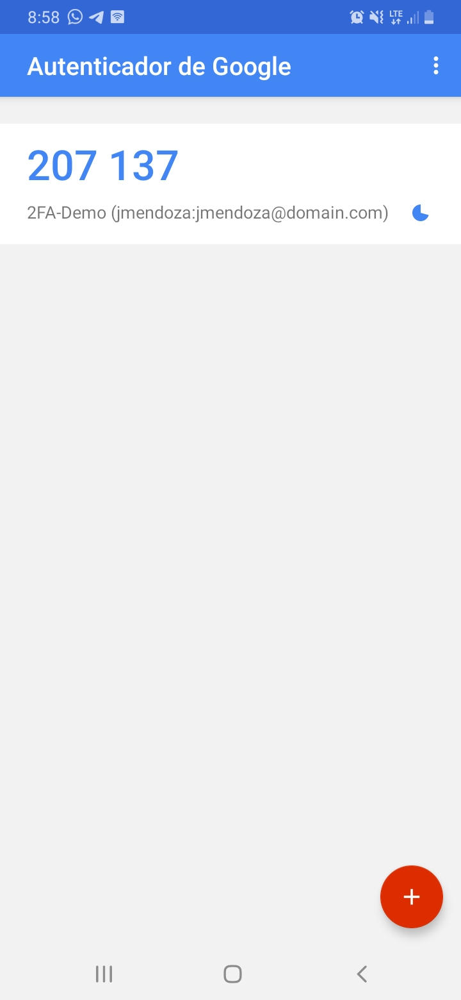

# Spring-Boot-2FA
Ejemplo 2FA Google Authenticator - Spring Boot

### Crear Base de datos en MySql
con nombre "totpdb" al ejecutar se creara la tabla correspondiente
#### Descargar la aplicacion de google autenticación en el celular

### Crear Usuario

### Crear QR 

### Escanear QR

### Validar TOTP key

